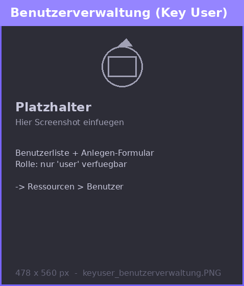

# Anleitung: Rolle Key User

<table>
  <tr>
    <td valign="top" width="42%">
      
    </td>
    <td valign="top">

## Überblick
Als `key_user` verwaltest du dein Team fachlich. Du bist die Schnittstelle zwischen Admin und normalen Nutzern.

## Was du typischerweise tust

### Benutzer im Team verwalten
- Lege neue `user` in deinem Team an
- Bearbeite bestehende Nutzer
- Entferne Nutzer aus deinem Team

### Teams nutzen
- Arbeite innerhalb deiner zugewiesenen Teams
- Setze Teamzuordnungen für deine Nutzer
- Pflege dein Standardteam

### Dokumente verwalten
- Lade Dokumente in deine Teams hoch
- Organisiere Inhalte für dein Team
- Nutze vorhandene Dokumente und Dateigruppen

### Anwendung nutzen
- Arbeite mit Chat, Dateien und Ressourcen
- Passe deine eigenen Einstellungen an

## Was du NICHT tun kannst
- Keine Admins oder andere Key User erstellen
- Keine Teams erstellen oder löschen
- Keine Systemkonfiguration (LLMs, Indizes etc.)
- Kein FileSync

## Wichtige Hinweise
- Du brauchst mindestens ein eigenes Team
- Du verwaltest nur deine eigenen (nicht-globalen) Teams
- Du hast immer Lese- und Uploadrechte

## Best Practice
- Halte dein Team sauber organisiert
- Gib Upload-Rechte bewusst weiter
- Unterstütze deine User bei der Nutzung der Plattform

    </td>
  </tr>
</table>